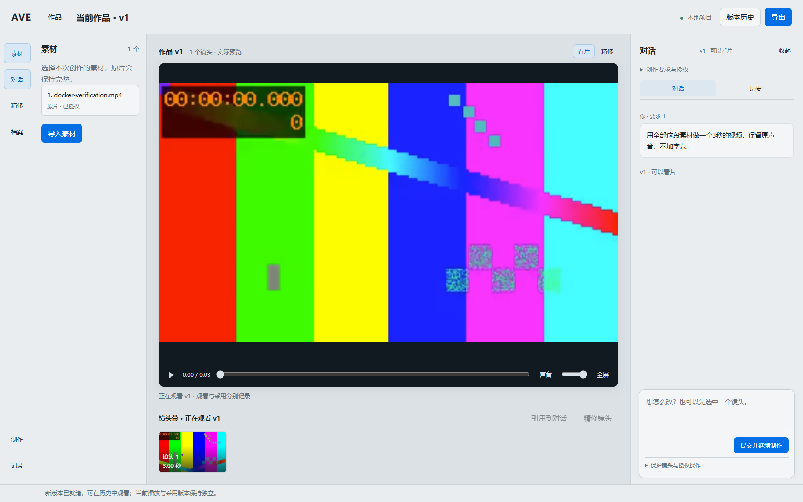

# AVE · AI Vlog Co-Editor

Turn your footage and a conversation into a versioned Vlog draft. Review the cut, ask for changes, and export the finished video from your browser.

[English](README.md) · [简体中文](README.zh-CN.md) · [Quick start](#quick-start) · [Documentation](docs/README.md) · [Report an issue](https://github.com/tealigantal/AVE/issues)

[](https://github.com/tealigantal/AVE/actions/workflows/ci.yml)



*Actual Docker browser workbench; footage shown is synthetic verification media.*

## What you can do

- **Start with footage and intent.** Upload media, describe the film you want, and create a draft in the conversation workbench.
- **Revise and retain history.** Keep versioned edits and continue saved projects after restarting the containers.
- **Review before exporting.** Play the Preview and download the Master, with separate rendering and QC checks.
- **Control external analysis.** Review exactly which material and context may be sent to configured cloud models.
- **Run the local stack in Docker.** Project Host, media Worker, FFmpeg, Whisper and YAMNet run in containers. Windows users only need Docker Desktop and a browser.

AVE is under active development. Browser creation/export has automated and synthetic-media verification; creative quality and the full planned editing scope have separate acceptance gates. See [current status](docs/current/STATUS.md) and [known gaps](docs/current/DEBT.md).

## Quick start

### 1. Get the repository

```sh
git clone https://github.com/tealigantal/AVE.git
cd AVE
```

Install and start [Docker Desktop](https://docs.docker.com/desktop/setup/install/windows-install/). On Windows, select **Linux containers**. Work from Windows PowerShell and your browser; no Ubuntu desktop or separate Node/Python/FFmpeg installation is needed.

### 2. Configure your models once

In PowerShell:

```powershell
Copy-Item .env.example .env
notepad .env
```

On macOS/Linux use `cp .env.example .env` and your editor. Fill both keys:

```dotenv
AVE_VISION_API_KEY=your-vision-key
AVE_PLANNER_API_KEY=your-planner-key
```

Defaults use Qwen cloud vision/planning, local Whisper-small transcription and local YAMNet sound analysis. Cloud calls need network access and may incur provider charges. Keep `.env` private; it is excluded from Git and image builds. Existing users should retain their configured `.env`.

### 3. Start AVE

```sh
docker compose up
```

When ready, open **[http://localhost:6080](http://localhost:6080)**. First startup builds images and downloads pinned local models; later starts reuse the persistent cache. Download time depends on your connection.

Compose runs only `desktop` (browser Host and media stack) and `whisper` (transcription). Each service initializes its own configuration/cache, leaving no stopped initialization containers.

For background operation:

```sh
docker compose up -d --wait --wait-timeout 1800
```

## Your first film

1. Create a project and upload video/audio through the workbench.
2. Describe your goal, review the exact external-analysis authorization, and start creation.
3. Watch the preview, request revisions, and download the exported Master when satisfied.

Closing the browser does not stop Docker. Projects and uploaded media remain in persistent volumes.

## CPU and NVIDIA GPU

The default Compose configuration requests no GPU and uses **CPU**. Both devices use the same pinned Whisper-small: CPU/int8 or CUDA/float32.

On Windows, `Start-AVE-Docker.cmd` checks actual Docker/CUDA capability and saves the selection in `.env`; afterward keep using `docker compose up`. To configure NVIDIA manually:

```dotenv
COMPOSE_FILE=compose.yaml|docker/compose.gpu.yaml
COMPOSE_PATH_SEPARATOR=|
AVE_WHISPER_DEVICE=cuda
```

Use a compatible driver and [Docker Desktop GPU support](https://docs.docker.com/desktop/features/gpu/). Explicit CUDA selection fails when unusable; it does not silently switch to CPU.

## Data and everyday commands

| Data | Storage |
| --- | --- |
| Projects and SQLite | `ave-desktop_projects` Docker volume |
| Uploaded source media | `ave-desktop_uploads` Docker volume |
| User profile / recent projects | `ave-desktop_profile` Docker volume |
| Whisper cache | `ave-desktop_whisper-models` Docker volume |
| Private runtime configuration | `ave-desktop_configuration` Docker volume |
| Optional mounted sources | `./materials`, read-only |
| Exported videos | `./exports`, plus browser download |

Set `AVE_MATERIALS` / `AVE_EXPORTS` in `.env` to change host directories. Existing Windows launcher installations may use `%LOCALAPPDATA%/AVE/docker/`. Native projects are not automatically migrated. Keep projects on a Docker volume rather than a Windows bind directory: Host requires Linux file-permission semantics.

```sh
# Stop; retain projects, uploads, exports and caches
docker compose down

# Rebuild after pulling updates; retain data
docker compose up -d --build --wait --wait-timeout 1800

# Inspect startup and failures
docker compose ps
docker compose logs --tail=100 desktop whisper
```

After changing model keys/settings, use `docker compose up -d --force-recreate --wait --wait-timeout 1800`. Use `docker compose down -v` only when you intend to delete persistent data. Check logs for private information before posting them publicly.

Startup troubleshooting: Docker Desktop must be running, both keys filled, port 6080 free and any selected GPU usable. Configuration, download and model failures are reported explicitly. See the [Docker guide](docs/04-engineering/DOCKER_DESKTOP.md).

## How AVE works

The browser sends typed requests to **Project Host**, the sole project-state and SQLite write authority. Models propose candidates; Host validates and commits edits. A committed Timeline produces one Semantic Render Manifest, separate Preview/Master RenderGraphs and execution plans; Worker/FFmpeg renders and QC checks outputs.

| Area | Source |
| --- | --- |
| Browser adapter / workbench | `apps/web/`, `apps/desktop/src/renderer/` |
| Project authority / persistence | `packages/platform/project-host/`, `packages/platform/project-storage/` |
| Media execution | `apps/worker-host/` |
| Typed protocols | `contracts/` |
| Container packaging | `compose.yaml`, `docker/` |

See [architecture](docs/architecture/SYSTEM_ARCHITECTURE.md), [product scope](docs/product/EDITING_CAPABILITY_SCOPE_V1.md) and [roadmap](docs/product-intelligence/STAGE3_PLAN.md). Planned, implemented and accepted capabilities are distinguished.

## Development and contribution

For source development use Node.js 22, pnpm 11.9.0 and Python/media tools described in the [engineering guide](docs/04-engineering/README.md). Use an isolated Python environment with the [pinned Worker dependencies](apps/worker-host/requirements.txt); the checks require Pillow 12.3.0. Activate it before running the commands below.

```sh
pnpm install --frozen-lockfile
pnpm run check
pnpm run acceptance:final:synthetic
```

Start with [AGENTS.md](AGENTS.md), [documentation home](docs/README.md), [document index](docs/DOCUMENT_INDEX.md) and the relevant domain authority. Current state is generated: edit its sources, then run `pnpm run docs:sync` and `pnpm run docs:check`.

Bug reports and focused PRs are welcome. Include reproduction steps, OS/device, relevant errors and expected behavior; remove API keys and private media. Consult [current work](docs/current/WORK.md) before expanding scope. Automated verification, real-media evidence and human acceptance are reported separately.

## License

This repository currently has no declared project license. Public source availability does not itself grant an open-source license; clarify permission with the maintainer before redistribution or reuse.
