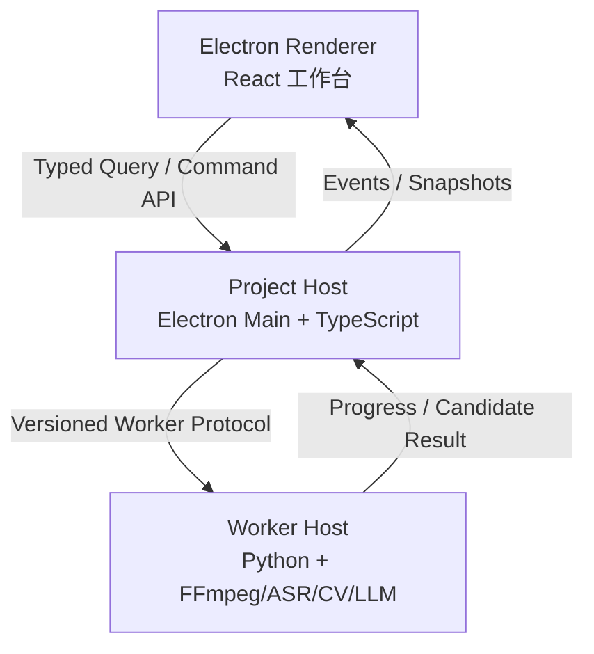
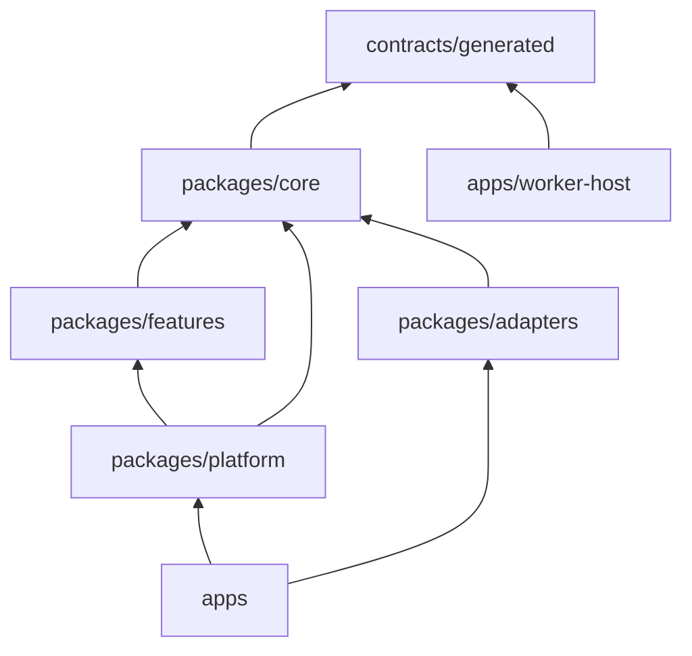
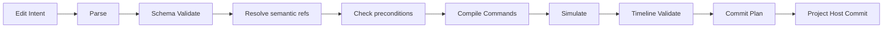
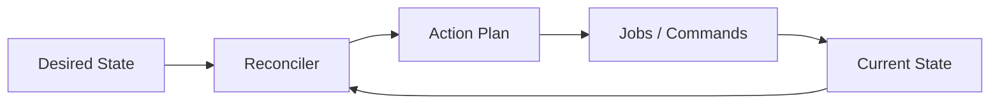

> **Historical source document，不是当前状态或当前执行规范。**

# AI Vlog Co-Editor 工程架构与仓库蓝图

- **版本**：v2.0
- **日期**：2026-07-29
- **文档性质**：工程架构、仓库结构、协议边界、施工顺序与 Coding Agent 执行规范
- **适用对象**：产品负责人、技术负责人、前后端工程师、AI/多媒体工程师、Codex/Coding Agent
- **上位文档**：《AI Vlog Co-Editor 产品总计划与系统设计规范 v1.0》
- **状态**：基座设计稿，可用于初始化仓库和拆分首批工作单

> 本文不重新定义产品目标。它把产品总计划中已经确定的 Evidence Graph、Creative Decision、Edit IR、版本化时间线、统一 RenderGraph 和最终成片 QC，落实为可以直接创建目录、文件、接口、迁移和测试的工程结构。

---

## 0. 本文解决什么问题

本项目最危险的失败方式，不是某个模型效果不够好，而是：

1. 前期协议随意设计，后期增加字幕、广告、隐私或专业导出时被迫重做；
2. UI、AI、数据库和时间线互相直接调用，任何局部修改都引发连锁崩溃；
3. TypeScript、Python 和数据库分别维护一套数据定义，逐渐产生语义漂移；
4. Coding Agent 创建大量空接口和“通用服务”，却没有真实视频闭环；
5. 模型输出直接落地，导致非法素材引用、版本覆盖和用户锁失效；
6. 项目崩溃后只能重新分析数小时素材；
7. 旧项目无法被新版本打开，或升级后静默改变剪辑结果；
8. 预览正常但最终渲染丢失效果、使用代理或音画不同步。

本架构通过以下约束解决这些问题：

- 三个运行边界；
- 一个项目状态权威；
- 一个跨语言协议源；
- 一个时间基准；
- 一个数据库写入者；
- 一个时间线修改入口；
- 一个渲染语义；
- 不可变版本与事务提交；
- 可恢复后台任务；
- 真实素材垂直切片优先于复杂 Agent。

---

# 1. 架构定案

## 1.1 产品工程形态

系统定义为：

> **由 Project Host 控制的本地视频编译系统。**

对应关系：

| 编译系统概念 | AI Vlog Co-Editor |
|---|---|
| 源代码 | Creative Contract、用户决定、参考风格 |
| 输入数据 | 原始视频、音频、图片、品牌资产 |
| 事实索引 | Media Catalog、Transcript、Evidence Graph |
| 中间表示 | Story Plan、Edit Intent、Edit IR、RenderGraph |
| 可执行程序 | Timeline Document |
| 编译产物 | Preview、Review Render、Master MP4 |
| 编译检查 | Timeline Validator、Sponsor/Privacy/AV QC |
| 增量编译 | 失效传播、局部重算、局部渲染 |

模型只是“候选语义与编辑计划生成器”，不是系统权威。

## 1.2 三个运行边界



### Electron Renderer

负责：

- 工作台界面；
- 播放器；
- 素材浏览；
- 故事板；
- 时间线交互；
- AI 对话；
- 显示任务进度；
- 收集用户批准、拒绝、A/B 选择。

不得：

- 直接访问 SQLite；
- 直接访问项目原片路径；
- 直接执行 shell 或 FFmpeg；
- 直接调用模型 SDK；
- 将 Zustand/Redux 状态作为项目真相；
- 直接修改 Timeline Document。

### Project Host

负责：

- 项目创建、打开、关闭；
- 当前项目会话；
- 唯一 SQLite 写入；
- Object Store 指针；
- Command/Query/Event；
- Editorial State；
- Timeline State；
- Job 生命周期；
- 审批 Gate；
- 锁；
- 版本；
- 失效传播；
- Worker 调度；
- Worker 候选结果验证；
- 原子提交；
- 崩溃恢复；
- 项目升级。

Project Host 是唯一项目权威。

### Worker Host

负责：

- ffprobe；
- FFmpeg；
- 指纹计算；
- 代理、缩略图、波形；
- ASR/VAD/说话人；
- OCR、镜头、视觉索引；
- 模型调用；
- Preview/Master Render；
- 最终文件 QC。

不得：

- 打开或修改 `project.sqlite`；
- 修改项目阶段；
- 批准合同或故事；
- 提交时间线版本；
- 更改用户锁；
- 将日志写入 stdout 协议流；
- 假设任务结果一定会被接受。

---

# 2. 不可违反的架构宪法

以下规则必须同时写入 `ARCHITECTURE.md`、`AGENTS.md` 和自动化架构测试。

## 2.1 单一权威

1. **Project Host 是项目状态唯一权威。**
2. **SQLite 只有一个写入者：Project Host。**
3. **Timeline Core 是剪辑执行状态唯一权威。**
4. **Editorial Core 是创作语义状态唯一权威。**
5. **Contracts 是跨语言数据定义唯一权威。**
6. **Timebase 是时间表示唯一权威。**
7. **RenderGraph 是预览与 Master 的效果语义唯一权威。**

## 2.2 修改纪律

1. UI、AI、脚本和手工操作都必须生成 Command。
2. AI 修改必须先形成 Edit IR。
3. Edit IR 必须经过 Resolve、Simulate、Validate。
4. 只有 Project Host 可以 Commit。
5. Commit 必须是数据库事务。
6. Commit 失败时旧版本保持不变。
7. 所有 Command 都带 `base_version`。
8. 版本不匹配时不得覆盖，必须 Rebase 或要求用户选择。

## 2.3 协议纪律

1. 所有跨模块对象有 `schema_version`。
2. TypeScript 与 Python 类型从 JSON Schema 生成。
3. 同一主版本只能增加可选字段。
4. 字段语义变化必须升主版本。
5. 删除字段必须先弃用，并提供迁移。
6. 旧 Fixture 必须可以升级到当前版本。
7. Generated 文件禁止手工修改。
8. 数据库表不是模块公共协议。

## 2.4 素材纪律

1. 文件名不是素材身份。
2. 素材身份由稳定 ID 与内容指纹共同确定。
3. 权威时间不能使用浮点秒。
4. 所有时间必须使用 RationalTime 或 PTS 映射。
5. 最终渲染必须回到原片。
6. 代理无法回映原片时阻断 Master。
7. 源范围越界时阻断提交。

## 2.5 AI 权限纪律

模型允许：

- 生成候选合同 Patch；
- 生成 Observation/Interpretation 候选；
- 生成故事候选；
- 生成 Feedback Diagnosis；
- 生成 Edit Intent/Edit IR 候选；
- 生成复审 Issue 候选。

模型禁止：

- 写 SQLite；
- 直接操作 Timeline；
- 自动批准；
- 删除素材；
- 越过用户锁；
- 自行修改项目阶段；
- 编造不存在的 Moment、Event、产品证据；
- 在素材不足时生成虚假真实事件。

---

# 3. 总体依赖方向



允许：

```text
apps → platform → features → core → generated contracts
apps → adapters → core
platform → core
features → core
worker-host → Python generated contracts
```

禁止：

```text
core → platform
core → features
core → apps
feature-a → feature-b/internal/*
renderer → project-storage
renderer → worker-host
worker-host → project-storage
model-adapter → timeline-repository
timeline-core → Electron/React/SQLite/FFmpeg
```

所有包只能从其他包的 `public.ts` 导入，禁止：

```ts
import { Something } from "@ai-vlog/timeline-core/src/internal/...";
```

---

# 4. 完整仓库结构

```text
ai-vlog-co-editor/
├── AGENTS.md
├── README.md
├── ARCHITECTURE.md
├── CONTRIBUTING.md
├── SECURITY.md
├── CHANGELOG.md
├── LICENSE
├── package.json
├── pnpm-workspace.yaml
├── pnpm-lock.yaml
├── tsconfig.base.json
├── tsconfig.packages.json
├── eslint.config.mjs
├── vitest.workspace.ts
├── dependency-cruiser.cjs
├── pyproject.toml
├── uv.lock
├── .editorconfig
├── .gitignore
├── .gitattributes
├── .npmrc
│
├── apps/
│   ├── desktop/
│   ├── worker-host/
│   └── dev-cli/
│
├── contracts/
│   ├── README.md
│   ├── schemas/
│   ├── examples/
│   ├── migrations/
│   ├── compatibility/
│   └── generated-manifest.json
│
├── packages/
│   ├── core/
│   ├── platform/
│   ├── features/
│   └── adapters/
│
├── database/
│   ├── migrations/
│   ├── fixtures/
│   ├── schema-snapshots/
│   └── README.md
│
├── tools/
│   ├── contract-codegen/
│   ├── architecture-check/
│   ├── project-fixture/
│   ├── media-fixture-builder/
│   ├── golden-updater/
│   └── release/
│
├── tests/
│   ├── architecture/
│   ├── contract/
│   ├── integration/
│   ├── property/
│   ├── golden/
│   ├── acceptance/
│   ├── regression/
│   ├── performance/
│   └── hidden-fixtures/
│
├── docs/
│   ├── contracts/
│   ├── workflows/
│   ├── decisions/
│   ├── work-orders/
│   ├── runbooks/
│   ├── evaluations/
│   └── diagrams/
│
├── scripts/
│   ├── bootstrap.mjs
│   ├── generate-contracts.mjs
│   ├── check-contracts.mjs
│   ├── check-architecture.mjs
│   ├── check-generated-clean.mjs
│   ├── run-worker-smoke.mjs
│   ├── create-fixture-project.mjs
│   ├── run-acceptance.mjs
│   ├── run-golden.mjs
│   └── package-desktop.mjs
│
└── .github/
    ├── CODEOWNERS
    ├── pull_request_template.md
    ├── ISSUE_TEMPLATE/
    │   ├── bug.yml
    │   ├── architecture-change.yml
    │   └── work-order.yml
    └── workflows/
        ├── ci.yml
        ├── contracts.yml
        ├── architecture.yml
        ├── worker.yml
        ├── golden.yml
        ├── acceptance.yml
        ├── security.yml
        └── release.yml
```

---

# 5. 根目录文件职责

## `AGENTS.md`

面向 Coding Agent 的最高优先级施工规则。

必须包含：

- 当前工作单编号；
- 允许修改目录；
- 禁止修改目录；
- 架构不变量；
- 必跑命令；
- 真实验收案例；
- 明确非目标；
- 失败停止条件；
- Generated 文件列表；
- 禁止创建的目录名；
- 不确定时的处理方式。

建议结构：

```markdown
# Agent Rules
## Current Work Order
## Allowed Paths
## Forbidden Paths
## Invariants
## Commands
## Acceptance
## Stop Conditions
```

## `README.md`

只包含：

- 产品一句话；
- 环境要求；
- 安装；
- 开发启动；
- 测试入口；
- 文档索引。

禁止在此重复完整架构。

## `ARCHITECTURE.md`

只保存长期稳定内容：

- 三进程模型；
- 权威边界；
- 依赖图；
- Command 主链；
- Worker 主链；
- 存储边界；
- 版本策略；
- 不变量。

功能细节放到 `docs/contracts` 和 `docs/workflows`。

## `CONTRIBUTING.md`

包含：

- PR 尺寸；
- Schema 修改流程；
- Migration 流程；
- Golden 更新流程；
- Work Order 完成流程；
- ADR 触发条件；
- 真实素材测试要求。

## `SECURITY.md`

包含：

- 原片本地优先；
- 云端上传策略；
- API Key；
- 日志脱敏；
- IPC 安全；
- Electron `contextIsolation`、sandbox、sender 校验；
- 远程 URL 与外链策略；
- 项目清除；
- 漏洞报告。

## `CHANGELOG.md`

只记录用户可见变化、项目格式变化、Schema 主版本变化。普通重构不记录。

## `tsconfig.base.json`

必须启用：

```json
{
  "compilerOptions": {
    "strict": true,
    "noImplicitAny": true,
    "exactOptionalPropertyTypes": true,
    "noUncheckedIndexedAccess": true,
    "noImplicitOverride": true,
    "useUnknownInCatchVariables": true,
    "verbatimModuleSyntax": true
  }
}
```

## `dependency-cruiser.cjs`

执行依赖边界检查。CI 中不得允许 warning 模式，违规直接失败。

---

# 6. `apps/desktop`：桌面应用

```text
apps/desktop/
├── package.json
├── electron.vite.config.ts
├── tsconfig.json
├── resources/
│   ├── icons/
│   └── entitlements/
├── src/
│   ├── main/
│   │   ├── main.ts
│   │   ├── bootstrap.ts
│   │   ├── composition-root.ts
│   │   ├── app-lifecycle.ts
│   │   ├── window-manager.ts
│   │   ├── protocol-handler.ts
│   │   ├── project-session-manager.ts
│   │   ├── menu-manager.ts
│   │   ├── updater.ts
│   │   └── ipc/
│   │       ├── register-ipc.ts
│   │       ├── validate-sender.ts
│   │       ├── project.handlers.ts
│   │       ├── media.handlers.ts
│   │       ├── editorial.handlers.ts
│   │       ├── story.handlers.ts
│   │       ├── timeline.handlers.ts
│   │       ├── render.handlers.ts
│   │       ├── qc.handlers.ts
│   │       └── jobs.handlers.ts
│   │
│   ├── preload/
│   │   ├── index.ts
│   │   ├── project-api.ts
│   │   ├── api-types.ts
│   │   └── event-subscriptions.ts
│   │
│   └── renderer/
│       ├── index.html
│       ├── main.tsx
│       ├── app/
│       │   ├── App.tsx
│       │   ├── router.tsx
│       │   ├── providers.tsx
│       │   ├── error-boundary.tsx
│       │   └── startup-screen.tsx
│       │
│       ├── workbench/
│       │   ├── ProjectWorkbench.tsx
│       │   ├── WorkbenchLayout.tsx
│       │   ├── RequirementPanel.tsx
│       │   ├── MediaLibraryPanel.tsx
│       │   ├── StoryBoardPanel.tsx
│       │   ├── VideoPreviewPanel.tsx
│       │   ├── TimelinePanel.tsx
│       │   ├── AssistantPanel.tsx
│       │   └── JobStatusPanel.tsx
│       │
│       ├── features/
│       │   ├── project/
│       │   ├── interview/
│       │   ├── references/
│       │   ├── media/
│       │   ├── evidence/
│       │   ├── story/
│       │   ├── timeline/
│       │   ├── feedback/
│       │   ├── sponsor/
│       │   ├── privacy/
│       │   └── delivery/
│       │
│       ├── api/
│       │   ├── project-client.ts
│       │   ├── query-hooks.ts
│       │   ├── command-hooks.ts
│       │   └── event-client.ts
│       │
│       ├── state/
│       │   ├── ui-session.store.ts
│       │   ├── selection.store.ts
│       │   ├── playback.store.ts
│       │   └── layout.store.ts
│       │
│       ├── components/
│       │   ├── ApprovalCard.tsx
│       │   ├── CompareViewer.tsx
│       │   ├── DiffViewer.tsx
│       │   ├── ErrorNotice.tsx
│       │   ├── LockBadge.tsx
│       │   ├── ProgressBar.tsx
│       │   └── ValidationIssueList.tsx
│       │
│       └── styles/
│           ├── tokens.css
│           └── global.css
└── tests/
    ├── main/
    ├── preload/
    ├── renderer/
    └── e2e/
```

## 6.1 Main 进程文件

### `main.ts`

唯一 Electron 入口。

只做：

1. 设置进程级错误捕获；
2. 等待 `app.whenReady()`；
3. 调用 `bootstrap()`；
4. 处理退出。

不得包含数据库、业务流程或 IPC 细节。

### `bootstrap.ts`

严格启动顺序：

1. 读取应用配置；
2. 初始化结构化日志；
3. 检查 FFmpeg/Python 环境；
4. 初始化 Project Host；
5. 启动 Worker Host；
6. 完成协议握手；
7. 注册 IPC；
8. 创建窗口；
9. 恢复上次项目会话。

任一步失败必须进入明确故障页，禁止“部分成功”。

### `composition-root.ts`

全项目唯一依赖装配处。

创建：

- Clock；
- ID Generator；
- SQLite Storage；
- Object Store；
- Contract Registry；
- Worker Client；
- Job Engine；
- Project Host；
- Feature Services；
- IPC Router。

其他文件禁止自行构造这些单例。

### `protocol-handler.ts`

注册自定义安全协议，例如 `app://`，避免直接依赖 `file://` 加载本地界面。

### `project-session-manager.ts`

负责：

- 同一时间打开哪个项目；
- 项目锁文件；
- 防止重复打开；
- 切换项目；
- 关闭前检查；
- 崩溃后清理失效 Session。

### `validate-sender.ts`

所有 IPC Handler 第一行调用，验证消息来自允许的窗口和 URL。

### `*.handlers.ts`

只做：

1. 验证 IPC Envelope；
2. 调用 Project API；
3. 标准化返回；
4. 不写业务判断。

## 6.2 Preload

### `project-api.ts`

通过 `contextBridge` 暴露逐项、窄接口：

```ts
window.aiVlog.queryProject(...)
window.aiVlog.sendCommand(...)
window.aiVlog.subscribeProjectEvents(...)
window.aiVlog.chooseFiles(...)
```

禁止：

```ts
window.aiVlog.send(channel, payload)
window.aiVlog.ipcRenderer
window.aiVlog.fs
```

### `api-types.ts`

引用 `project-api` 生成类型，确保 Renderer 不能使用未授权 API。

## 6.3 Renderer

### `state/`

只能存：

- 播放头；
- 当前选区；
- 面板布局；
- 临时输入；
- 当前 UI 筛选。

不能存：

- Creative Contract 权威版本；
- Timeline 权威版本；
- Job 权威状态；
- Approval；
- Lock。

### `features/*`

Renderer Feature 只包含：

```text
components/
hooks/
view-models/
formatters/
```

不包含 Repository、领域模型修改器或模型 SDK。

---

# 7. `apps/worker-host`：Python 计算宿主

```text
apps/worker-host/
├── pyproject.toml
├── README.md
├── src/
│   └── worker_host/
│       ├── __init__.py
│       ├── main.py
│       ├── registry.py
│       ├── config.py
│       │
│       ├── protocol/
│       │   ├── __init__.py
│       │   ├── server.py
│       │   ├── reader.py
│       │   ├── writer.py
│       │   ├── envelopes.py
│       │   ├── handshake.py
│       │   └── errors.py
│       │
│       ├── runtime/
│       │   ├── job_context.py
│       │   ├── cancellation.py
│       │   ├── progress.py
│       │   ├── subprocess_runner.py
│       │   ├── temp_workspace.py
│       │   ├── output_collector.py
│       │   ├── resource_limits.py
│       │   └── cleanup.py
│       │
│       ├── handlers/
│       │   ├── media_probe.py
│       │   ├── media_decode_check.py
│       │   ├── media_fingerprint.py
│       │   ├── build_proxy.py
│       │   ├── build_thumbnail.py
│       │   ├── build_filmstrip.py
│       │   ├── build_waveform.py
│       │   ├── extract_audio.py
│       │   ├── transcribe.py
│       │   ├── detect_speech.py
│       │   ├── diarize.py
│       │   ├── scene_detect.py
│       │   ├── run_ocr.py
│       │   ├── visual_index.py
│       │   ├── model_inference.py
│       │   ├── render_preview.py
│       │   ├── render_review.py
│       │   ├── render_master.py
│       │   └── qc_master.py
│       │
│       ├── adapters/
│       │   ├── ffmpeg.py
│       │   ├── ffprobe.py
│       │   ├── hasher.py
│       │   ├── funasr.py
│       │   ├── vad.py
│       │   ├── diarization.py
│       │   ├── scene_detector.py
│       │   ├── ocr_engine.py
│       │   ├── qwen_provider.py
│       │   ├── deepseek_provider.py
│       │   └── filesystem.py
│       │
│       ├── render/
│       │   ├── graph_reader.py
│       │   ├── ffmpeg_graph_compiler.py
│       │   ├── effect_registry.py
│       │   ├── codec_profiles.py
│       │   └── progress_parser.py
│       │
│       ├── qc/
│       │   ├── decode_check.py
│       │   ├── black_frame_check.py
│       │   ├── freeze_check.py
│       │   ├── silence_check.py
│       │   ├── clipping_check.py
│       │   ├── loudness_check.py
│       │   ├── av_sync_check.py
│       │   ├── subtitle_bounds_check.py
│       │   └── proxy_usage_check.py
│       │
│       ├── contracts/
│       │   └── generated/
│       └── diagnostics/
│           ├── environment_report.py
│           ├── codec_report.py
│           └── self_test.py
└── tests/
    ├── protocol/
    ├── runtime/
    ├── handlers/
    ├── adapters/
    ├── render/
    ├── qc/
    └── fixtures/
```

## 7.1 Worker 协议

采用长度前缀 JSON 或 JSON Lines。首版优先 JSON Lines，确保调试简单。

stdout 只允许：

```json
{
  "protocol_version": 1,
  "message_type": "job_progress",
  "request_id": "req_123",
  "job_id": "job_456",
  "payload": {}
}
```

stderr 只用于日志。

大对象通过内容寻址文件传递：

```json
{
  "object_ref": {
    "hash": "sha256:...",
    "path": "...",
    "media_type": "application/json"
  }
}
```

## 7.2 `registry.py`

显式映射任务处理器：

```python
HANDLERS = {
    "media.probe.v1": handle_media_probe,
    "media.proxy.v1": handle_build_proxy,
    "render.master.v1": handle_render_master,
    "qc.master.v1": handle_qc_master,
}
```

禁止反射式目录扫描，避免 Agent 新增文件后被自动执行。

## 7.3 Handler 与 Adapter 边界

Handler：

- 理解任务合同；
- 安排步骤；
- 验证输入；
- 生成结构化输出。

Adapter：

- 封装一个第三方工具；
- 标准化错误；
- 不理解项目业务。

例如 `render_master.py` 不手写散落的 FFmpeg 参数，必须调用 `ffmpeg_graph_compiler.py` 和 `ffmpeg.py`。

---

# 8. `apps/dev-cli`：无 UI 验证入口

```text
apps/dev-cli/
├── package.json
├── tsconfig.json
├── src/
│   ├── main.ts
│   ├── command-registry.ts
│   ├── commands/
│   │   ├── create-project.ts
│   │   ├── inspect-project.ts
│   │   ├── import-media.ts
│   │   ├── inspect-media.ts
│   │   ├── create-timeline.ts
│   │   ├── apply-command.ts
│   │   ├── apply-edit-ir.ts
│   │   ├── render-preview.ts
│   │   ├── render-master.ts
│   │   ├── run-qc.ts
│   │   ├── replay-job.ts
│   │   ├── migrate-project.ts
│   │   └── verify-project.ts
│   └── output/
│       ├── json-output.ts
│       └── human-output.ts
└── tests/
```

P0 阶段必须先通过 CLI 完成真实素材闭环，再做复杂 UI。

---

# 9. `contracts`：唯一跨语言协议源

```text
contracts/
├── README.md
├── schemas/
│   ├── common/
│   ├── project/
│   ├── media/
│   ├── editorial/
│   ├── timeline/
│   ├── render/
│   ├── qc/
│   ├── worker/
│   └── api/
├── examples/
│   ├── valid/
│   └── invalid/
├── migrations/
│   ├── editorial/
│   ├── timeline/
│   ├── worker/
│   └── project/
├── compatibility/
│   ├── policy.yaml
│   ├── reserved-fields.yaml
│   ├── migration-map.yaml
│   └── supported-versions.yaml
└── generated-manifest.json
```

## 9.1 Common Schema

```text
schemas/common/
├── uuid.v1.schema.json
├── content-hash.v1.schema.json
├── rational-time.v1.schema.json
├── time-range.v1.schema.json
├── object-ref.v1.schema.json
├── actor-ref.v1.schema.json
├── evidence-ref.v1.schema.json
├── validation-issue.v1.schema.json
├── error-envelope.v1.schema.json
└── pagination.v1.schema.json
```

## 9.2 Project Schema

```text
schemas/project/
├── project-manifest.v1.schema.json
├── project-stage.v1.schema.json
├── desired-state.v1.schema.json
├── current-state.v1.schema.json
├── project-event.v1.schema.json
├── decision.v1.schema.json
├── approval.v1.schema.json
├── lock.v1.schema.json
├── requirement.v1.schema.json
└── invalidation-plan.v1.schema.json
```

## 9.3 Media Schema

```text
schemas/media/
├── media-asset.v1.schema.json
├── media-location.v1.schema.json
├── media-stream.v1.schema.json
├── proxy-map.v1.schema.json
├── media-manifest.v1.schema.json
├── transcript.v1.schema.json
├── transcript-segment.v1.schema.json
├── media-inspection.v1.schema.json
└── media-relink-result.v1.schema.json
```

## 9.4 Editorial Schema

```text
schemas/editorial/
├── creative-contract.v1.schema.json
├── contract-patch.v1.schema.json
├── observation.v1.schema.json
├── interpretation.v1.schema.json
├── shot.v1.schema.json
├── moment.v1.schema.json
├── event.v1.schema.json
├── person.v1.schema.json
├── story-beat.v1.schema.json
├── style-profile.v1.schema.json
├── coverage-matrix.v1.schema.json
├── material-sufficiency.v1.schema.json
├── story-proposal.v1.schema.json
└── approved-story-plan.v1.schema.json
```

## 9.5 Timeline Schema

```text
schemas/timeline/
├── timeline-document.v1.schema.json
├── sequence.v1.schema.json
├── track.v1.schema.json
├── clip.v1.schema.json
├── caption.v1.schema.json
├── effect.v1.schema.json
├── timeline-command.v1.schema.json
├── timeline-version.v1.schema.json
├── timeline-diff.v1.schema.json
├── edit-intent.v1.schema.json
├── edit-ir.v1.schema.json
└── commit-plan.v1.schema.json
```

## 9.6 Render、QC、Worker、API Schema

每个边界独立分组，不允许把所有对象塞进一个 `types.schema.json`。

## 9.7 Schema 必备字段

```json
{
  "$schema": "https://json-schema.org/draft/2020-12/schema",
  "$id": "urn:ai-vlog:timeline-document:v1",
  "title": "TimelineDocumentV1",
  "type": "object",
  "additionalProperties": false,
  "required": ["schema_version"]
}
```

## 9.8 版本策略

| 变化 | 是否允许留在同一主版本 |
|---|---:|
| 增加可选字段 | 是 |
| 增加枚举值 | 默认否，除非消费者声明开放枚举 |
| 字段改名 | 否 |
| 字段类型变化 | 否 |
| 字段语义变化 | 否 |
| 删除字段 | 否 |
| 收紧校验 | 否 |
| 增加 `additionalProperties: false` | 否 |

所有主版本迁移必须是纯函数：

```text
v1 JSON → migrate → v2 JSON
```

不能在迁移中调用模型、FFmpeg 或网络。

---

# 10. `packages/core`：纯领域与纯算法

```text
packages/core/
├── project-kernel/
├── timebase/
├── media-identity/
├── editorial-core/
├── timeline-core/
├── edit-ir/
├── render-graph/
└── qc-core/
```

所有 Core 包禁止依赖：

- React；
- Electron；
- Node 文件系统；
- SQLite；
- Python；
- FFmpeg；
- 模型 SDK；
- 环境变量。

## 10.1 `project-kernel`

```text
src/
├── public.ts
├── ids.ts
├── result.ts
├── option.ts
├── domain-error.ts
├── project-stage.ts
├── project-event.ts
├── actor.ts
├── decision.ts
├── requirement.ts
├── approval.ts
├── lock.ts
├── desired-state.ts
├── current-state.ts
└── invariants.ts
```

文件职责：

- `ids.ts`：稳定 ID 类型和解析；
- `result.ts`：显式成功/失败，禁止异常作为正常控制流；
- `domain-error.ts`：统一领域错误；
- `requirement.ts`：硬约束、偏好和验证方式；
- `approval.ts`：批准对象和来源；
- `lock.ts`：语义锁、时间线锁；
- `desired-state.ts`：用户希望达到的状态；
- `current-state.ts`：当前完成状态。

## 10.2 `timebase`

```text
src/
├── public.ts
├── rational-time.ts
├── time-range.ts
├── time-math.ts
├── frame-rate.ts
├── frame-conversion.ts
├── pts-conversion.ts
├── proxy-time-map.ts
├── time-validation.ts
└── time-codec.ts
```

关键测试：

- VFR 原片到代理再回原片；
- 30000/1001；
- 23.976/25/30/50/59.94 混合；
- 音频 sample rate 到时间线；
- 长项目累计误差；
- 边界前后 1 frame。

全仓库禁止出现业务时间字段：

```ts
startSeconds: number
durationMs: number
```

API 边界可以临时显示毫秒，但进入领域前必须转换。

## 10.3 `media-identity`

```text
src/
├── public.ts
├── media-asset.ts
├── media-stream.ts
├── asset-location.ts
├── content-fingerprint.ts
├── source-range.ts
├── proxy-map.ts
├── relink-policy.ts
├── media-change-detector.ts
└── media-invariants.ts
```

## 10.4 `editorial-core`

```text
src/
├── public.ts
├── creative-contract.ts
├── requirement-set.ts
├── observation.ts
├── interpretation.ts
├── shot.ts
├── moment.ts
├── event.ts
├── person-registry.ts
├── style-profile.ts
├── coverage-matrix.ts
├── story-beat.ts
├── story-proposal.ts
├── approved-story-plan.ts
├── decision-log.ts
├── editorial-locks.ts
├── semantic-link.ts
└── editorial-invariants.ts
```

Observation 和 Interpretation 永远分开：

```text
Observation: 人物在 00:12:04 笑了
Interpretation: 人物因朋友订错日期而幸灾乐祸
```

后者必须带证据、置信度和审核状态。

## 10.5 `timeline-core`

```text
src/
├── public.ts
├── model/
│   ├── timeline-document.ts
│   ├── sequence.ts
│   ├── track.ts
│   ├── clip.ts
│   ├── gap.ts
│   ├── transition.ts
│   ├── caption.ts
│   ├── effect.ts
│   ├── keyframe.ts
│   ├── audio-routing.ts
│   └── semantic-sidecar.ts
├── commands/
│   ├── command.ts
│   ├── add-clip.ts
│   ├── remove-clip.ts
│   ├── replace-clip.ts
│   ├── move-clip.ts
│   ├── trim-source.ts
│   ├── roll-cut.ts
│   ├── ripple-delete.ts
│   ├── slip-clip.ts
│   ├── slide-clip.ts
│   ├── set-gain.ts
│   ├── add-caption.ts
│   ├── add-transition.ts
│   ├── set-effect.ts
│   ├── set-keyframe.ts
│   ├── set-speed.ts
│   ├── set-transform.ts
│   ├── lock-range.ts
│   └── unlock-range.ts
├── engine/
│   ├── apply-command.ts
│   ├── simulate-command.ts
│   ├── invert-command.ts
│   ├── replay-commands.ts
│   ├── transaction.ts
│   └── affected-range.ts
├── validation/
│   ├── validate-document.ts
│   ├── validate-media-refs.ts
│   ├── validate-source-ranges.ts
│   ├── validate-overlaps.ts
│   ├── validate-transitions.ts
│   ├── validate-locks.ts
│   ├── validate-captions.ts
│   └── validate-audio-routing.ts
├── versioning/
│   ├── timeline-version.ts
│   ├── timeline-diff.ts
│   ├── branch.ts
│   ├── merge.ts
│   └── conflict.ts
└── serialization/
    ├── timeline-codec.ts
    └── timeline-migrator.ts
```

每条 Command 包含：

```ts
interface TimelineCommand {
  commandId: string;
  commandType: string;
  schemaVersion: number;
  baseVersion: string;
  actor: ActorRef;
  targetIds: string[];
  parameters: unknown;
  preconditions: Precondition[];
  semanticRefs: SemanticRef[];
  affectedRanges: TimeRange[];
}
```

Inverse Command 可以执行时生成，不要求输入时由调用方提供。

## 10.6 `edit-ir`

```text
src/
├── public.ts
├── edit-intent.ts
├── edit-ir.ts
├── parser.ts
├── resolver.ts
├── precondition-checker.ts
├── command-compiler.ts
├── simulator.ts
├── validator.ts
├── commit-plan.ts
├── rebase.ts
├── patch-diff.ts
└── protected-ref-checker.ts
```

执行主链：



## 10.7 `render-graph`

```text
src/
├── public.ts
├── render-graph.ts
├── render-node.ts
├── media-node.ts
├── transform-node.ts
├── caption-node.ts
├── audio-node.ts
├── transition-node.ts
├── effect-definition.ts
├── render-profile.ts
├── capability-matrix.ts
├── graph-builder.ts
├── graph-validator.ts
└── fallback-policy.ts
```

每个效果必须描述：

- Preview 实现；
- Master 实现；
- 参数范围；
- 容差；
- 不支持策略；
- bake 策略。

## 10.8 `qc-core`

统一 Issue：

```ts
interface ReviewIssue {
  issueId: string;
  category: string;
  severity: "blocker" | "major" | "minor" | "suggestion";
  source: "timeline" | "preview" | "master";
  evidenceRefs: string[];
  affectedRanges: TimeRange[];
  requirementIds: string[];
  message: string;
}
```

---

# 11. `packages/platform`：应用基础设施

```text
packages/platform/
├── project-host/
├── project-storage/
├── job-engine/
├── worker-client/
├── project-api/
├── contract-runtime/
├── model-gateway/
└── observability/
```

## 11.1 `project-host`

```text
src/
├── public.ts
├── project-host.ts
├── composition.ts
├── application/
│   ├── command-bus.ts
│   ├── query-bus.ts
│   ├── unit-of-work.ts
│   ├── stage-gate-service.ts
│   ├── reconciler.ts
│   ├── invalidation-planner.ts
│   ├── approval-service.ts
│   ├── lock-service.ts
│   └── project-upgrader.ts
├── use-cases/
│   ├── create-project.ts
│   ├── open-project.ts
│   ├── close-project.ts
│   ├── import-assets.ts
│   ├── start-job.ts
│   ├── cancel-job.ts
│   ├── accept-worker-result.ts
│   ├── reject-worker-result.ts
│   ├── approve-editorial-output.ts
│   ├── submit-edit-intent.ts
│   ├── simulate-edit-patch.ts
│   ├── commit-edit-patch.ts
│   ├── revert-timeline-version.ts
│   ├── request-preview.ts
│   ├── request-master.ts
│   └── deliver-project.ts
└── ports/
    ├── project-repository.ts
    ├── editorial-repository.ts
    ├── timeline-repository.ts
    ├── job-repository.ts
    ├── event-repository.ts
    ├── object-store.ts
    ├── worker-port.ts
    ├── model-port.ts
    ├── clock.ts
    └── id-generator.ts
```

### `reconciler.ts`

比较 Desired State 与 Current State，输出最小 Action Plan。

示例：

```text
Desired: rough_cut based on story_v3
Current: assembly_cut based on story_v2

Plan:
1. invalidate timeline derived from story_v2
2. generate rough-cut candidate from story_v3
3. request local preview
4. wait for approval
```

### `invalidation-planner.ts`

失效规则写成确定性表，而不是模型判断：

```text
CreativeContract.duration changed
→ Sufficiency, StoryPlan, Timeline, Render, QC stale

SponsorContract.CTA changed
→ SponsorPlan, related Timeline effects, Render, SponsorQC stale

Caption spelling changed
→ Caption track, Render, SubtitleQC stale
```

## 11.2 `project-storage`

```text
src/
├── public.ts
├── sqlite/
│   ├── database.ts
│   ├── connection-options.ts
│   ├── transaction.ts
│   ├── migration-runner.ts
│   ├── integrity-check.ts
│   └── repositories/
│       ├── project-repository.ts
│       ├── asset-repository.ts
│       ├── editorial-repository.ts
│       ├── timeline-repository.ts
│       ├── job-repository.ts
│       ├── event-repository.ts
│       ├── model-run-repository.ts
│       └── qc-repository.ts
├── objects/
│   ├── content-addressed-store.ts
│   ├── object-path.ts
│   ├── object-verifier.ts
│   ├── object-index.ts
│   └── garbage-collector.ts
└── project-layout/
    ├── create-layout.ts
    ├── validate-layout.ts
    ├── project-lock.ts
    ├── portable-project.ts
    └── backup.ts
```

## 11.3 `job-engine`

```text
src/
├── public.ts
├── job.ts
├── job-attempt.ts
├── job-state-machine.ts
├── scheduler.ts
├── dispatcher.ts
├── retry-policy.ts
├── cancellation.ts
├── checkpoint.ts
├── recovery.ts
├── idempotency-key.ts
├── resource-class.ts
└── dependency-plan.ts
```

状态：

```text
PENDING
READY
RUNNING
PAUSED
WAITING_FOR_USER
RETRYABLE_FAILED
BLOCKED
SUCCEEDED
CANCELLED
```

## 11.4 `worker-client`

```text
src/
├── public.ts
├── worker-process.ts
├── protocol-client.ts
├── handshake.ts
├── request-map.ts
├── progress-router.ts
├── restart-policy.ts
├── stderr-log-router.ts
├── health-check.ts
└── worker-capabilities.ts
```

## 11.5 `project-api`

```text
src/
├── public.ts
├── commands.ts
├── queries.ts
├── events.ts
├── ipc-router.ts
├── authorization.ts
├── request-envelope.ts
├── response-envelope.ts
└── api-version.ts
```

## 11.6 `contract-runtime`

```text
src/
├── public.ts
├── schema-registry.ts
├── validator.ts
├── version-parser.ts
├── compatibility-checker.ts
├── migrator-registry.ts
├── generated-manifest-loader.ts
└── contract-error.ts
```

## 11.7 `model-gateway`

```text
src/
├── public.ts
├── model-gateway.ts
├── model-request.ts
├── model-result.ts
├── routing-policy.ts
├── structured-output.ts
├── cache-key.ts
├── replay.ts
├── retry-policy.ts
├── budget-policy.ts
├── privacy-policy.ts
├── providers/
│   ├── provider.ts
│   ├── qwen.ts
│   └── deepseek.ts
└── prompts/
    ├── prompt-registry.ts
    └── prompt-version.ts
```

模型调用必须记录：

- provider；
- model snapshot；
- prompt version；
- input hash；
- output hash；
- token usage；
- latency；
- retry；
- cache hit；
- privacy class。

## 11.8 `observability`

```text
src/
├── public.ts
├── logger.ts
├── trace-context.ts
├── audit-log.ts
├── job-log.ts
├── model-run-log.ts
├── redaction.ts
├── metrics.ts
└── crash-report.ts
```

---

# 12. `packages/features`：真实产品能力

每个 Feature 使用统一结构：

```text
feature-name/
├── package.json
├── src/
│   ├── public.ts
│   ├── commands/
│   ├── queries/
│   ├── use-cases/
│   ├── policies/
│   ├── validators/
│   ├── prompts/
│   └── ports/
└── tests/
```

Feature 之间只能通过公开对象和 Project Host 协作，禁止调用其他 Feature 内部 Service。

## 12.1 `project-interview`

```text
src/
├── public.ts
├── use-cases/
│   ├── start-interview.ts
│   ├── process-user-message.ts
│   ├── apply-manual-contract-patch.ts
│   ├── request-contract-review.ts
│   └── approve-contract.ts
├── policies/
│   ├── completeness-policy.ts
│   ├── question-priority.ts
│   └── approval-policy.ts
├── validators/
│   ├── contract-validator.ts
│   └── conflict-validator.ts
├── services/
│   ├── contract-patch-builder.ts
│   ├── conflict-detector.ts
│   ├── next-question-planner.ts
│   └── contract-summary.ts
└── prompts/
    ├── interview-director.v1.md
    └── contract-review.v1.md
```

## 12.2 `reference-analysis`

- `reference-ingestion.ts`
- `style-feature-extractor.ts`
- `style-conflict-detector.ts`
- `style-profile-builder.ts`
- `style-approval-policy.ts`

## 12.3 `media-ingestion`

- `import-assets.ts`
- `media-scan-plan.ts`
- `proxy-plan.ts`
- `analysis-plan.ts`
- `asset-relink.ts`
- `ingestion-validator.ts`

## 12.4 `evidence-building`

- `observation-builder.ts`
- `interpretation-builder.ts`
- `moment-builder.ts`
- `event-builder.ts`
- `person-linker.ts`
- `evidence-graph-validator.ts`

## 12.5 `material-sufficiency`

- `coverage-requirements.ts`
- `coverage-matrix-builder.ts`
- `missing-beat-detector.ts`
- `sufficiency-classifier.ts`
- `sufficiency-report-builder.ts`

## 12.6 `story-planning`

- `candidate-generator.ts`
- `constraint-filter.ts`
- `coverage-evaluator.ts`
- `difference-clusterer.ts`
- `proposal-presenter.ts`
- `story-approval.ts`

## 12.7 `assembly-cut`

- `beat-to-moment-selector.ts`
- `assembly-plan.ts`
- `assembly-edit-ir-builder.ts`
- `assembly-validator.ts`

## 12.8 `feedback`

- `feedback-classifier.ts`
- `feedback-diagnosis.ts`
- `hypothesis-builder.ts`
- `candidate-fix-builder.ts`
- `compare-plan.ts`
- `feedback-edit-intent.ts`

## 12.9 `rough-cut`

- `dialogue-boundary-planner.ts`
- `reaction-timing-planner.ts`
- `pause-policy.ts`
- `jl-cut-planner.ts`
- `rough-cut-edit-ir-builder.ts`

## 12.10 `fine-cut`

- `caption-plan.ts`
- `music-energy-plan.ts`
- `ducking-plan.ts`
- `effect-plan.ts`
- `fine-cut-edit-ir-builder.ts`

## 12.11 `sponsor`

- `sponsor-contract.ts`
- `claim-validator.ts`
- `story-coverage.ts`
- `timeline-validator.ts`
- `render-validator.ts`
- `sponsor-report.ts`

## 12.12 `privacy`

- `privacy-ledger.ts`
- `upload-policy.ts`
- `timeline-privacy-validator.ts`
- `render-privacy-validator.ts`
- `retention-policy.ts`

## 12.13 `delivery`

- `delivery-plan.ts`
- `delivery-gate.ts`
- `export-manifest.ts`
- `media-usage-list.ts`
- `delivery-package.ts`

---

# 13. `packages/adapters`

```text
packages/adapters/
├── freecut-adapter/
├── web-preview-adapter/
├── otio-adapter/
├── fcpxml-adapter/
├── edl-adapter/
└── desktop-filesystem-adapter/
```

## `freecut-adapter`

FreeCut 仅作为 UI 与交互底座。

```text
src/
├── public.ts
├── freecut-to-command.ts
├── timeline-to-freecut-view.ts
├── selection-adapter.ts
├── playback-adapter.ts
└── manual-edit-reconciler.ts
```

不得把 FreeCut Store 作为 Timeline 权威。

## `otio-adapter`

```text
src/
├── public.ts
├── timeline-to-otio.ts
├── otio-to-timeline.ts
├── capability-matrix.ts
├── roundtrip-validator.ts
└── semantic-sidecar.ts
```

内部 Timeline 格式比 OTIO 多保存：

- AI 语义；
- Requirement；
- 用户锁；
- Edit IR 来源；
- 选择原因；
- RenderGraph 映射。

OTIO 只负责交换和归档。

---

# 14. 数据库设计

```text
database/
├── migrations/
│   ├── 0001_project_core.sql
│   ├── 0002_media_identity.sql
│   ├── 0003_editorial_state.sql
│   ├── 0004_timeline_versions.sql
│   ├── 0005_jobs.sql
│   ├── 0006_model_runs.sql
│   ├── 0007_render_and_qc.sql
│   └── 0008_privacy_and_rights.sql
├── fixtures/
│   ├── empty-project.sql
│   └── sample-project.sql
├── schema-snapshots/
│   └── v1.sql
└── README.md
```

## 14.1 表与所有者

| 表 | 作用 | 允许写入者 |
|---|---|---|
| `projects` | 项目元数据 | Project Host |
| `project_events` | 重要领域事件 | Project Host |
| `project_state` | Desired/Current 指针 | Project Host |
| `assets` | 稳定素材身份 | Project Host |
| `asset_locations` | 原片位置和重连 | Project Host |
| `proxy_maps` | 原片/代理映射 | Project Host |
| `requirements` | 硬约束与偏好 | Project Host |
| `decisions` | 用户决定 | Project Host |
| `approvals` | Gate 批准 | Project Host |
| `locks` | 编辑和语义锁 | Project Host |
| `artifact_versions` | 大对象版本元数据 | Project Host |
| `artifact_edges` | 依赖关系 | Project Host |
| `artifact_heads` | 当前有效指针 | Project Host |
| `timeline_versions` | 时间线版本 | Project Host |
| `timeline_commands` | Command Log | Project Host |
| `jobs` | 任务当前状态 | Job Engine |
| `job_attempts` | 每次尝试 | Job Engine |
| `model_runs` | 模型调用记录 | Model Gateway 经 Host |
| `render_outputs` | 渲染结果 | Project Host |
| `qc_issues` | QC 问题 | Project Host |
| `privacy_ledger` | 隐私处理记录 | Project Host |
| `rights_ledger` | 版权许可 | Project Host |

## 14.2 大对象不直接塞 SQLite

以下进入内容寻址 Object Store：

- Transcript；
- Evidence Graph；
- Story Proposal；
- Timeline Snapshot；
- Edit IR；
- RenderGraph；
- 模型原始输入输出；
- QC Report；
- Preview/Render 元数据。

SQLite 保存哈希、关系和当前指针。

## 14.3 事务边界

一次 Timeline Commit 至少同时写：

1. Timeline Snapshot Object；
2. `timeline_versions`；
3. `timeline_commands`；
4. `artifact_heads`；
5. 下游 stale 标记；
6. `project_events`。

上述操作必须同一事务提交。Object Store 使用“先写临时文件、fsync、原子 rename，再写数据库指针”。

---

# 15. 用户项目磁盘结构

```text
my-vlog-project/
├── project.json
├── project.sqlite
├── project.lock
├── originals/
├── links/
│   └── asset-locations.json
├── derived/
│   ├── proxies/
│   ├── thumbnails/
│   ├── filmstrips/
│   ├── waveforms/
│   ├── extracted-audio/
│   └── analysis-media/
├── objects/
│   └── sha256/
│       ├── 00/
│       ├── 01/
│       └── ...
├── previews/
├── renders/
├── exports/
├── licenses/
├── logs/
├── crash/
└── temp/
```

## `project.json`

只保存引导信息：

```json
{
  "project_id": "uuid",
  "project_format_version": 1,
  "database": "project.sqlite",
  "created_at": "ISO-8601",
  "portable": false
}
```

不得复制全部业务状态。

## `temp/`

可随时删除。任何重要结果不得只存在于这里。

## `originals/`

默认外链原片；用户启用便携项目时才复制。

---

# 16. Project API

Renderer 只访问以下抽象：

```ts
interface ProjectApi {
  query<T>(request: QueryEnvelope): Promise<QueryResult<T>>;
  command<T>(request: CommandEnvelope): Promise<CommandResult<T>>;
  subscribe(listener: (event: ProjectEvent) => void): Unsubscribe;
}
```

Command 与 Query 分离：

- Query 不改变项目；
- Command 必须有幂等键；
- Command 返回提交版本或明确失败；
- 长任务 Command 只返回 `job_id`；
- Renderer 订阅 Job Event 获取进度。

示例 Command：

```json
{
  "api_version": 1,
  "command_type": "timeline.commit_edit_ir",
  "command_id": "uuid",
  "idempotency_key": "uuid",
  "project_id": "uuid",
  "base_version": "timeline-v17",
  "payload": {}
}
```

---

# 17. Worker Job 合同

```json
{
  "protocol_version": 1,
  "task_type": "render.preview.v1",
  "job_id": "uuid",
  "attempt": 1,
  "idempotency_key": "hash",
  "inputs": [],
  "parameters": {},
  "output_policy": {
    "directory": "...",
    "expected_media_type": "video/mp4"
  },
  "resource_policy": {
    "cpu_class": "high",
    "gpu": "optional",
    "memory_mb": 4096
  }
}
```

结果：

```json
{
  "protocol_version": 1,
  "message_type": "job_result",
  "job_id": "uuid",
  "status": "succeeded",
  "outputs": [],
  "metrics": {},
  "diagnostics": []
}
```

错误必须分类：

- `INVALID_INPUT`
- `MISSING_MEDIA`
- `UNSUPPORTED_CODEC`
- `RESOURCE_EXHAUSTED`
- `CANCELLED`
- `EXTERNAL_TOOL_FAILED`
- `MODEL_OUTPUT_INVALID`
- `TEMPORARY_PROVIDER_ERROR`
- `INTERNAL_BUG`

只有临时错误允许自动重试。

---

# 18. Desired State / Current State 与 Reconciler

状态机负责 Gate；Reconciler 负责重算。



示例：

```text
用户修改目标时长
→ Desired State 更新
→ Reconciler 发现 StoryPlan 与 Timeline 基于旧时长
→ Invalidation Planner 标记下游 stale
→ 创建重新充分性判断任务
→ 等用户批准新故事
→ 才允许生成新 Timeline
```

Reconciler 每次输出确定性的 `ActionPlan`，并保存 Plan Hash，方便重放与调试。

---

# 19. 崩溃恢复

## 19.1 Project Host 崩溃

启动时：

1. 检查 SQLite Integrity；
2. 检查 migration 状态；
3. 检查未完成事务；
4. 清理临时 Object；
5. 加载最后已提交 Timeline；
6. 将 RUNNING Job 改为 RECOVERING；
7. 根据 Job 幂等性决定重试或阻断；
8. 重新连接 Worker。

## 19.2 Worker 崩溃

- Project Host 不受损；
- 当前 Attempt 标记失败；
- Worker Client 重启；
- Job Engine 根据 Retry Policy 决定；
- 非幂等任务不得盲目重跑；
- 输出临时文件在下次启动清理。

## 19.3 数据库迁移失败

- 原项目不得继续打开；
- 自动保留备份；
- 输出迁移日志；
- 不允许部分迁移；
- 提供只读恢复模式。

---

# 20. 安全与隐私

Electron 必须：

- `contextIsolation: true`；
- Renderer sandbox；
- `nodeIntegration: false`；
- CSP；
- 校验 IPC sender；
- 不暴露通用 IPC；
- 不加载带 Node 权限的远程内容；
- 外链必须 allowlist；
- 禁止不可信 URL 触发本地命令。

模型上传：

- 每个素材片段有 Privacy Class；
- Model Gateway 在调用前检查；
- 默认上传代理片段而非原片；
- 日志不保存裸视频帧；
- 敏感 Prompt 进行脱敏；
- 缓存可按项目彻底清除。

---

# 21. 测试架构

```text
tests/
├── architecture/
├── contract/
├── integration/
├── property/
├── golden/
├── acceptance/
├── regression/
├── performance/
└── hidden-fixtures/
```

## 21.1 Architecture Tests

必须覆盖：

- 依赖方向；
- 禁止深层导入；
- Core 不依赖基础设施；
- Worker 不访问 SQLite；
- Renderer 不访问 Node；
- 单一 Timebase；
- Generated 文件无手改；
- Feature 间无内部引用。

## 21.2 Contract Tests

- 所有 valid example 通过；
- 所有 invalid example 失败；
- TS/Python roundtrip；
- 旧版本迁移；
- 兼容性检查；
- 未知字段拒绝；
- 枚举兼容策略。

## 21.3 Property Tests

Timeline Core：

- 200–1000 条随机 Command；
- Apply + Inverse 回到原状态；
- Replay 与直接结果一致；
- 失败 Command 不改变状态；
- 所有 Source Range 合法；
- 所有 ID 唯一；
- Version 单调。

## 21.4 Golden Tests

保存：

- Timeline Snapshot；
- RenderGraph；
- 关键帧；
- 波形摘要；
- QC Report；
- 导出 OTIO/FCPXML。

Golden 更新必须人工确认原因。

## 21.5 P0 Acceptance

```text
创建项目
→ 导入真实手机 VFR 视频
→ 生成代理
→ 建立 ProxyMap
→ 创建 Timeline
→ AddClip
→ TrimSource
→ MoveClip
→ Undo
→ Redo
→ 生成 RenderGraph
→ 局部 Preview
→ 原片 Master
→ Master QC
→ 关闭
→ 重启
→ 状态完全一致
```

P0 不通过，不进入复杂 Story Agent。

---

# 22. CI 工作流

## `ci.yml`

- install；
- typecheck；
- lint；
- unit；
- package build。

## `contracts.yml`

- schema validate；
- examples；
- codegen；
- generated clean；
- compatibility；
- TS/Python roundtrip。

## `architecture.yml`

- dependency-cruiser；
- forbidden imports；
- single DB writer；
- single timebase。

## `worker.yml`

- Python lint/typecheck；
- protocol tests；
- FFmpeg smoke；
- cancellation；
- crash restart。

## `golden.yml`

- Golden Timeline/RenderGraph；
- key frame diff；
- audio summary diff。

## `acceptance.yml`

使用较小真实/授权 Fixture 跑 P0 完整闭环。大型私有素材在本地验收环境运行。

---

# 23. Coding Agent 工作单模板

```markdown
# WO-XXX：名称

## 用户结果
用户最终获得什么可见能力。

## 真实问题
为什么现有系统不能实现该结果。

## 允许修改
- path/a
- path/b

## 禁止修改
- path/c
- contracts 中非本工作单 Schema

## 输入合同
列出 Schema 和版本。

## 输出合同
列出 Schema 和版本。

## 必须创建/修改的文件
逐个文件列出职责。

## 不变量
任何情况下不得破坏的规则。

## 实现步骤
按顺序列出，不允许跳步。

## 必跑测试
给出具体命令。

## 真实验收
使用哪份 Fixture、执行什么操作、观察什么结果。

## 失败停止条件
出现什么情况必须停止，不得临时绕过。

## 明确非目标
本工作单不做什么。

## Definition of Done
可机器验证和人工验证的完成标准。
```

低能力 Coding Agent 每次只执行一个 Work Order，禁止把 P0 全部一次性交给模型。

---

# 24. 首批工作单

## WO-001：Monorepo 与架构检查

输出：

- 根配置；
- Workspace；
- Project References；
- dependency-cruiser；
- 空包只包含真实 public API 和测试，不创建虚假业务实现。

## WO-002：Contract Toolchain

输出：

- JSON Schema Registry；
- TS/Python codegen；
- example validator；
- compatibility checker；
- generated clean check。

## WO-003：Project Layout 与 SQLite 单写入

输出：

- 创建/打开/关闭项目；
- migration；
- Object Store；
- project lock；
- integrity check。

## WO-004：RationalTime

输出：

- RationalTime；
- TimeRange；
- PTS；
- ProxyTimeMap；
- VFR tests。

## WO-005：Media Identity

输出：

- Asset；
- fingerprint；
- location；
- relink；
- source range。

## WO-006：Worker Protocol

输出：

- Python Host；
- handshake；
- progress；
- cancellation；
- restart；
- structured error。

## WO-007：Media Probe 与 Proxy

输出：

- ffprobe；
- decode check；
- proxy；
- original/proxy mapping。

## WO-008：Timeline Model

输出：

- Timeline/Sequence/Track/Clip；
- codec；
- invariant validator。

## WO-009：Timeline Commands

输出：

- Add/Remove/Move/Trim；
- transaction；
- inverse；
- replay。

## WO-010：Timeline Version 与 Lock

输出：

- version；
- undo/redo；
- branch；
- lock；
- base version conflict。

## WO-011：Edit IR

输出：

- Schema；
- Resolver；
- Compiler；
- Simulator；
- CommitPlan；
- Rebase。

## WO-012：RenderGraph

输出：

- 基础图；
- capability；
- effect definition；
- validator。

## WO-013：Preview/Master

输出：

- Preview Worker；
- Master Worker；
- 原片回链；
- 基础效果一致性。

## WO-014：Master QC

输出：

- decode；
- black/freeze；
- silence/clipping/loudness；
- proxy usage；
- report。

## WO-015：P0 真实垂直切片

必须使用真实素材完成完整闭环。

---

# 25. 开发阶段 Gate

## P0：剪辑工程可靠性

必须完成：

- 项目存储；
- 素材身份；
- 时间基准；
- Worker；
- Timeline；
- Edit IR；
- Render；
- QC；
- 崩溃恢复。

禁止：

- 多 Agent；
- 复杂故事理解；
- 大量 UI 美化；
- 花字系统；
- 自动广告策划。

## P1：项目语义和素材理解

- Interview；
- Creative Contract；
- ASR/OCR/Scene；
- Observation/Moment/Event；
- Sufficiency。

## P2：故事与 Assembly Cut

- Reference Style；
- Story Proposal；
- Story Approval；
- Assembly Edit IR。

## P3：反馈与 Rough Cut

- Feedback Diagnosis；
- Compare；
- Reaction Timing；
- Dialogue/J/L Cut；
- Patch Rebase。

## P4：Fine Cut 与交付

- 字幕；
- 音乐；
- Ducking；
- 广告；
- 隐私；
- 专业导出；
- 最终 Evaluation。

---

# 26. Definition of Done

任何 Feature 完成必须同时满足：

1. Schema 已定义；
2. TS/Python 类型来自生成；
3. 核心逻辑有单元测试；
4. 边界有 Contract Test；
5. 失败路径有测试；
6. 可观测日志存在且已脱敏；
7. 崩溃/取消行为明确；
8. 没有绕过 Command 或 Worker；
9. 至少一个真实 Fixture 验收；
10. 文档和 ADR 已更新；
11. 不新增架构违规；
12. 改善了明确的用户结果或成片质量。

“代码能运行”不等于完成。

---

# 27. 架构变更控制

以下变化必须提交 ADR：

- 新增进程；
- 新增数据库；
- 改变单写入者；
- 改变 Timeline 内部格式；
- 改变权威时间表示；
- 改变 Worker Protocol；
- 引入新的 Agent Orchestrator；
- 让 Worker 直接访问项目数据；
- 让 UI 直接修改 Timeline；
- 改变项目目录格式；
- Contract 主版本升级。

ADR 必须包含：

- 问题；
- 选择；
- 替代方案；
- 兼容性影响；
- 数据迁移；
- 回滚；
- 测试；
- 对旧项目影响。

---

# 28. 禁止出现的坏味道

禁止创建无明确边界的：

```text
packages/shared
packages/common
packages/utils
services/ai-service
services/video-service
plugins/everything
helpers/index.ts
```

禁止：

- 巨型 `manager.ts`；
- 巨型 `types.ts`；
- 在 React Hook 中写业务事务；
- 在多个地方构建 FFmpeg 命令；
- 在多个语言手写同一协议；
- 使用文件路径作为 Asset ID；
- 使用浮点秒作为权威时间；
- 原地覆盖 Timeline；
- 模型输出直接入库；
- 捕获错误后返回空成功；
- 测试中跳过真实媒体验证；
- 为单个 Vlog Fixture 硬编码故事逻辑；
- 在迁移失败后强行打开项目；
- 将代理用于 Master 而不阻断；
- 为赶进度关闭 Schema 校验。

---

# 29. 初始化仓库时第一批必须真实存在的文件

不得一次性创建全部业务空文件。首次提交只创建：

```text
AGENTS.md
README.md
ARCHITECTURE.md
package.json
pnpm-workspace.yaml
tsconfig.base.json
dependency-cruiser.cjs

contracts/README.md
contracts/schemas/common/rational-time.v1.schema.json
contracts/schemas/common/time-range.v1.schema.json
contracts/schemas/project/project-manifest.v1.schema.json
contracts/schemas/worker/worker-envelope.v1.schema.json

packages/core/project-kernel/src/public.ts
packages/core/timebase/src/public.ts
packages/core/timebase/src/rational-time.ts
packages/core/timebase/src/time-range.ts

packages/platform/contract-runtime/src/public.ts
packages/platform/project-storage/src/public.ts

apps/worker-host/src/worker_host/main.py
apps/worker-host/src/worker_host/protocol/server.py

tools/contract-codegen/
tests/architecture/
tests/contract/
docs/decisions/ADR-0001-three-process-model.md
docs/work-orders/WO-001-contract-toolchain.md
```

其他文件随着 Work Order 创建。这样可以避免生成一个看似完整、实际全是 TODO 的空壳仓库。

---

# 30. 参考框架与采用边界

1. **Electron Process Model / Context Isolation**
   采用 Main、Renderer、Preload 的权限分离和窄 IPC；不向 Renderer 暴露通用 Electron API。

2. **Kubernetes Controller Pattern**
   借鉴 Desired State / Current State / Reconcile，但不引入 Kubernetes。

3. **JSON Schema 2020-12**
   作为跨语言协议单一来源，配合代码生成和运行时校验。

4. **SQLite Atomic Commit / WAL**
   用于本地项目单写入、多读取和事务恢复；不把 SQLite 表当跨模块协议。

5. **OpenTimelineIO**
   借鉴 Schema 版本升级/降级和格式 Adapter；OTIO 作为交换层，不作为内部全部语义真相。

6. **Git 内容寻址思想**
   大对象按内容哈希保存，版本只保存引用；不实现完整 Git。

---

# 31. 官方参考资料

- Electron Process Model：<https://www.electronjs.org/docs/latest/tutorial/process-model>
- Electron Context Isolation：<https://www.electronjs.org/docs/latest/tutorial/context-isolation>
- Electron Security：<https://www.electronjs.org/docs/latest/tutorial/security>
- Electron IPC：<https://www.electronjs.org/docs/latest/tutorial/ipc>
- JSON Schema Draft 2020-12：<https://json-schema.org/draft/2020-12>
- Kubernetes Controllers：<https://kubernetes.io/docs/concepts/architecture/controller/>
- OpenTimelineIO Overview：<https://opentimelineio.readthedocs.io/en/latest/>
- OpenTimelineIO Adapters：<https://opentimelineio.readthedocs.io/en/latest/tutorials/adapters.html>
- OpenTimelineIO Schema Versioning：<https://opentimelineio.readthedocs.io/en/v0.16.0/tutorials/versioning-schemas.html>
- SQLite Atomic Commit：<https://www.sqlite.org/atomiccommit.html>
- SQLite WAL：<https://www.sqlite.org/wal.html>

---

# 32. 最终结论

本架构不是为了把目录划分得漂亮，而是为了确保：

- 低能力 Coding Agent 也只能在明确边界内施工；
- 某个模型、ASR 或剪辑 UI 可以替换；
- 项目协议可以演进而不摧毁旧项目；
- AI 永远不能绕过 Edit IR 和 Timeline Validator；
- 原片、代理和时间线始终可精确回链；
- 长任务可以恢复；
- 预览与 Master 使用同一语义；
- 最终交付由真实 MP4 QC 决定；
- 产品仍以用户愿意发布为最终标准。

工程实施应严格从 WO-001 开始。P0 真实垂直切片未完成前，不进入复杂 Agent 和包装系统。
