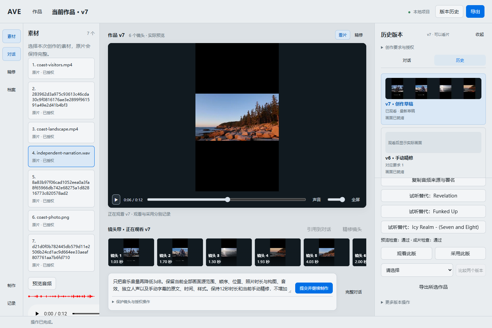
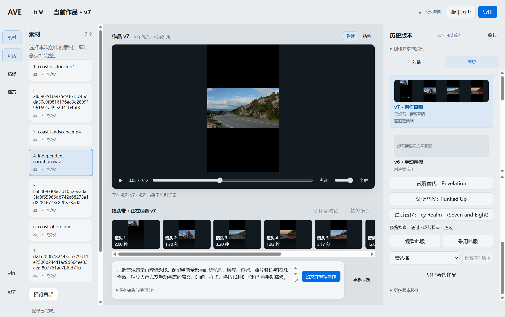

# Mixed-media engineering and actual product journeys

P1–P4 user behaviors are integrated through the existing Host/Command/IR/Commit and separate Preview/Master plans. Browser and Electron completed licensed two-video/photo/independent-voice initial creation, actual automatically fetched music, five atomic manual versions (gain, picture, author caption, original-site SFX, music replacement), then exact two-call production-model local continuation. Final gain is -24 dB with current 12-second music usage, not full-source capacity. Successful first drafts, v2–v6 manual history and v7 remain normally reopenable. Invalid model/download/identity/authorization/protection responses retain their original cause and prior work; none was rewritten or silently retried.

## Actual receipts and review files

[Public review manifest](../assets/mixed-media-p5/review-manifest.json) contains exact source licenses/hash/transforms, project/request/draft/revision and render identities, new offline operation IDs, two physical planner calls and unchanged exported Master hashes. Full source files, provider outputs/ledger and failed attempts remain outside Git. Source paths were resolved to the actual Windows storage identity before screenshot inspection and copy. The fixed 40-music/80-SFX catalog has 120 independent content hashes, source/license/decode/PTS/waveform audit receipts; no full library audio is committed. First pack is individually verified CC0; CC BY source snapshots/export are exercised by controlled policy tests. [Catalog](../../../resources/audio/free-audio-2026.10.02.1.json).

| Surface | Final real model run / draft | Revision / Timeline | Preview and Master SHA256 |
| --- | --- | --- | --- |
| Browser | 00b30bef-e573-4fcc-be10-435dcff7a657 | r6 / v7 | 879a14005d2ba502d01a655d3b4780dc364c815548eedb97523e83d65df5ced0 |
| Electron | 8aba2e00-b48e-45b2-bbcd-8aa0eb5d9c2c | r3 / v7 | 9e7921c579edfc19efebea875852e4d334dbd3539b1aee8f694eb65287cc19f6 |

Each surface decoded and actually played its final Preview; Master plus audio JSON/credits export matched exact output bytes. After successful cache cleanup, normal close/reopen and a random new offline render operation created four new jobs, actual double encode/QC/decode and unchanged semantic manifest with zero Host fetch attempts. This is Host network-fetch denial, not OS network isolation. Actual models: Qwen vision/planner (qwen3-vl-plus / qwen3.7-max-2026-05-20), local Systran faster-whisper-small and YAMNet. No test-only provider supplied these real decisions. Final attempt identities: browser-1791016855189 and electron-1791016088132; earlier failures and the discarded close-order attempt remain preserved.

[Browser Master with audio](../assets/mixed-media-p5/browser-master.mp4), [Electron Master with audio](../assets/mixed-media-p5/electron-master.mp4), [silent actual Electron playback/history excerpt](../assets/mixed-media-p5/electron-playback-excerpt.mp4). The excerpt is a reviewed continuous 10..28-second segment of the original screen recording, re-encoded only for review size. It is not the complete journey or human listening acceptance.

## Independent review and boundary fixes

Two read-only reviewers reproduced and rechecked exact-receipt/J-cut protected retention, all-color final-schema compilation, async apply ownership, filtered pending audition, visible errors, player preloading and bounded HTTP shutdown. No remaining blocking finding. Regression verifies original authorized receipt/association, exact negative offsets, no empty allOf, generation plus live-row ownership, source-bounded fades without disabling unrelated QC and exact retained author text/time/style/provenance without weakening ordinary observation requirements. Historical unmarked/v1–v3 planning task branches and 64 fixed Skill source bytes remain unchanged. Browser's existing failed input-flush behavior remains an explicit error, not a claim that a failed Browser shutdown keeps the window open.

## Validation

Passed contracts:check (83 valid/invalid schemas), typecheck, architecture (1437 files), docs:check, complete pnpm check7 and acceptance:final:synthetic4. Check7 includes current actual Electron controlled DOM race tests, Worker media/QC, mixed formats, precision and soundtrack suites. The bounded HTTP shutdown change landed after check7 began; latest source passed TypeScript, actual web-host incomplete-body shutdown regression and the complete real Browser journey. Final full remote check/security on the eventual exact PR head remains required. No production runtime changed after those latest scoped checks. Full logs stay outside Git, with immutable content identities:
- ave-p5-final-contracts.log: SHA256 c31acedf0ad709804aea8b20f4eaa4004acebfaad225bfd9a188696d7c1db88d
- ave-p5-final-typecheck.log: SHA256 6f152c60882e60b9775e330992882660fb396a01fd2e64717e4763ca8c031b9c
- ave-p5-final-architecture.log: SHA256 137b11f011f74758ce825d1e656137fb33deab26c64fca5c4ce5003277ee0f76
- ave-p5-final-docs.log: SHA256 c646ed74a1ce6b15c02c4a852de14ebcc80151e5fc5b3f43b3fa7db71524d757
- ave-p5-check7.log: SHA256 15ea797791bcafa170d3d6ac6cb1d02b030fcc8590f8b7a7b4c9e5d0cac3b168
- ave-p5-final-synthetic4.log: SHA256 808ee2be19b86adf6d26d7db235b2963715d55f148e292583e025e6bcde27184
- ave-p5-web-close.log: SHA256 b3e273d5bd5a59a99eb508a5e6b1e8b0b2d0c06c8f5de102d47190b1511fcfa9

## Remaining gate

P5 remains the sole active package until one Draft PR is created/attached, final documentation publication and final-head remote CI are verified. Human aesthetic/listening acceptance and historical Stage3/Stage2 debts remain pending; this is engineering verification, not Stage Exit, merge, release or deployment.

## Applicability
- CAP-RENDER-001; scope_fingerprint: dcff541fb7e48776f9bdf51999f71ea69628429f38b7cb55e86cd1cfc6f0984c
- CAP-PRESET-001; scope_fingerprint: 728fb6000bf8d399a4891b2a606b3602fe47f3d7457a9edc18e6cd350154dc7c
- CAP-FND-001; scope_fingerprint: 588cef672c79f8a2c875b9469145f8fad1ae478934adfa03549f6204d947a5d2
- CAP-CA-GOV-001; scope_fingerprint: eea690497108abd6e3c64ad6f72eaac890da2ea8d61de5466a07f3b14626f538
- CAP-CA-CONTEXT-001; scope_fingerprint: 8bc3a941a547f1afad6a419223df4916cd8bbe302d2364015254671716698ac6
- CAP-CA-SKILL-001; scope_fingerprint: 1da26512aad901b565f2a2aa5f2631e51918b58a059076bf449732f86250542f
- CAP-CA-DURATION-001; scope_fingerprint: c49ab2fe432db5b3d40cc2ef9962c4b5aeec219eef0b4bac8e736f46034b6d6b
- CAP-CA-STORY-001; scope_fingerprint: 286d7459eac2628d7422367e38c33f1c84ab98f8e8fd3b8662f5b944f20bd94e
- CAP-CA-PERMISSION-001; scope_fingerprint: 20d505548ae006a3c062374591083b7b63963b9f2456a352731f0dc275c2adb6
- CAP-CA-PIPELINE-001; scope_fingerprint: a774163a47afe8db31a542e9337f5c301361cd49975a0925346b93e6068b935a
- CAP-CA-FEEDBACK-001; scope_fingerprint: f184b3c053800e3f46cfc323ab3b581734216b875d8ac8054b4b036696193b13
- CAP-CA-PRODUCT-001; scope_fingerprint: 28f8bf2054e1ff293a383b5ed5a765d9734eb39b6642440c740b4ac19e4e282a
- CAP-CA-PRODUCT-002; scope_fingerprint: 005f6cae0a9ec0ea2300b0d545f5cc35c3c3dba148161d539177827903abe525
- CAP-CA-UX-001; scope_fingerprint: c0878b0195fa737f42aea66efb396fbf1c9f00d6bb8f0561126ffe97f0c4915d
- CAP-CA-EXIT-001; scope_fingerprint: 1554d6d4ba98b4505567d3a0b0a621fbc4bada783877b28eab980b4b8a68281f
- CAP-CA-GOV-003; scope_fingerprint: 1dc11fd58a6f098f1133ba18709d28350bc844daeb35ca22741656443893ad4d
- CAP-CA-GOV-002; scope_fingerprint: 1a55b172c2f72cd42d0d13b4064cadf3e0354392226d7a3e2250e029e83ac742
- CAP-CA-SEC-001; scope_fingerprint: 130db6a48e8929a92ec1519640d714af427b62e0c2a0cd5a122a9c9453d163a9
- CAP-CA-RECON-001; scope_fingerprint: 966daf3871bfd7ece095b1049d8aad072f2a2d2aefb4c160cd3e2d2e1b39b594
- CAP-S3-FIRST-LOOP-001; scope_fingerprint: 8b1c9713bfe515847cdd38094bc747b4f5d01d3b29b09a79af394e7672bfea49
- CAP-S3-SKILL-001; scope_fingerprint: baa30a6aa8b50923aed075c504c3f12119071182958db8063990a566d7e64b44
- CAP-S3-DOCKER-001; scope_fingerprint: 22c1ee47030da200497af708a2a2a3b50d2febc72a11d0f75112cf5730e06d4b
- CAP-S3-WEB-001; scope_fingerprint: d052f69b80e8f13f96a0f15913e8b31660165163089fdcd6d827700b09aa16d0
- CAP-S3-DOCKER-CLEAN-001; scope_fingerprint: 4b59cd6112531fa7d56f1f4d5e8b519f40700361a0b950b2879bc520afc88c9b
- CAP-S3-MEDIA-001; scope_fingerprint: 8f54898328758a8f7f7aa85d390686ed4930eb48742143ecae8209d4a62532e2
- CAP-S3-AUDIO-PACK-001; scope_fingerprint: 47b2495e7cab5291aa83780474441c8ccca23d554ce883262050bf8ad2158839
- CAP-S3-SOUNDTRACK-001; scope_fingerprint: 594674e1f2fd35d76d6fb7109ceb326b54b0401e2b0ad820b793bced6c4cef6a
- CAP-S3-PRECISION-001; scope_fingerprint: 96a9c001f45b63a247a267f1169fb81bda2b1b5fa09a7cd3ccf64d7b2d46a28c
